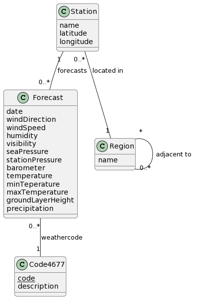

# Livl Weather 🌤️

Modeling a wheather forecasts database 🌦️

## **Table of contents**

- [⚒️ Cleaning data ](#cleaning-data)
    - [Cleaning SYNOP files](#cleaning-synop-files)
    - [Getting regions](#getting-regions)
- [💡Conception](#conception)
    - [Conceptual diagram](#conceptual-diagram)
    - [Logical diagram](#logical-diagram)
- [💾 Implementation](#implementation)
    - [Creating database](#creating-database)
    - [Requests](#requests)
    - [Procedures](#procedures)
- [🧍🏽Project team](#project-team)

## **⚒️ Cleaning data**

### **Cleaning SYNOP files**

The SYNOP data provided by *Météo France* contains a lot of information that we don't need. We created a shell script that keep only the useful data in the CSV file.

You can find the script [here](scripts/clean_synop.sh).

**Usage** : `./clean_synop.sh <input_file>`

This will overwrite the input file with the cleaned data.

**How it works ?**

We are simply using the `cut` command to keep only the columns we need.

### **Getting regions**

Each rows in the source SYNOP file contains the full region name. We created a script that keep only region names, sort them, and keep only unique values.

You can find the script [here](scripts/clean_regions.sh).

**Usage** : `./clean_regions.sh <input_file>`

Provide a `.csv` SYNOP file as input, and the script will create a `regions.csv` file with one unique region name per line.

**How it works ?**

First, the script skip the first line of the file (the header). Then, it uses the `cut` command to keep only the region name column and the `sort` command to sort the regions alphabetically. Finally, it uses the `uniq` command to keep only unique values.

## **💡Conception**

### **Conceptual diagram**

The conceptual diagram contains the following entities :
- `Forecast` contains the forecast for a given day. We decided to only use the most useful attributes to work with such as the wind preassure/direction, the temperature (min/max), and so on. 
- `Station` 
- `Region` has a one to many relationship with `Station` since a region can have many stations. And there is a many to many relationship with itself to represent the fact that a region can have many neighbors.
- `Code4677` contains the description of each different kind of forecast. The attribute `code` is the primary key of this table since it is unique. 

> The Conceptual Diagram is available [here](model/conceptual.puml).

### **Logical diagram**

We translated one to many relations to a foreign key, and many to many relations to a junction table. We also added a primary key to each table.

`Forecast`(<u>stationId</u>FK, <u>date</u>, windDirection, windSpeed, humidity, visibility, seaPressure, stationPressure, barometer, temperature, minTemperature, maxTemperature, groundLayerHeight, precipitation, code4677FK)

`Station`(<u>stationId</u>, name, latitude, longitude, altitude, regionFK)

`Region`(<u>regionId</u>, name)

`AdjacentRegion`(<u>regionId</u>FK, <u>adjacentRegionId</u>FK)

`Code4677`(<u>code</u>, description)

> The Logical Diagram is available [here](model/logical.md).

## **💾 Implementation**

### **Creating database**

Run the [`CreateTables.sql`](scripts/CreateTables.sql) script to create the database and the tables.

This will create an empty `Weather` database containing the tables described in the logical diagram.

To insert the data, run the [`InsertData.sql`](scripts/InsertData.sql) script.

Make sure that the following files are in the `./data` folder before running the script.
- [`regions.csv`](data/regions.csv)
- [`forecast.csv`](data/forecasts.csv)
- [`regions-adjacent.csv`](data/regions-adjacent.csv)
- [`code_4677.csv`](data/codes_4677.csv)
- [`stations.csv`](data/stations.csv)	

They will be used to insert data into the database.

### **Requests**

All requests are in the [`Requests.sql`](scripts/Requetes.sql) script.

### **Procedures**

All procedures are in the [`Procedures.sql`](scripts/Procedures.sql) script.

## **🧍🏽Project team**

<table align="center">
    <tr>
        <th> <strong>@FranckG28</strong></th>
        <th> <strong>@jvondermarck</strong></th>
    </tr>
    <tr align="center">
        <td><b>Franck Gutmann</b></td>
        <td><b>Julien Von Der Marck</b></td>
    </tr>
</table>
